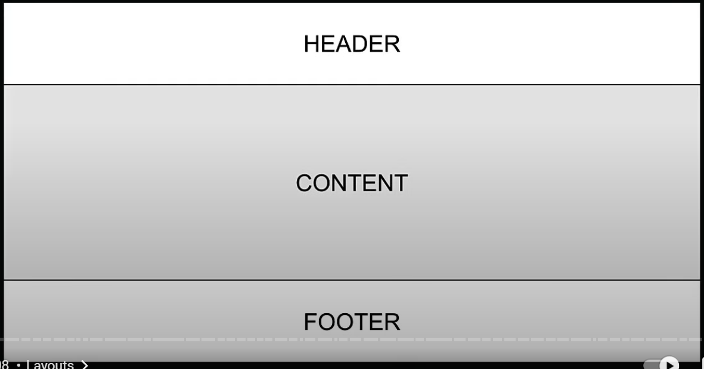

A layout is UI that shared between multiple pages in the app.

- this is a root layout. root layout.tsx is mandatory and every nextjs app must have one.
- this will cause all pages have this layout no matter what routes they are.