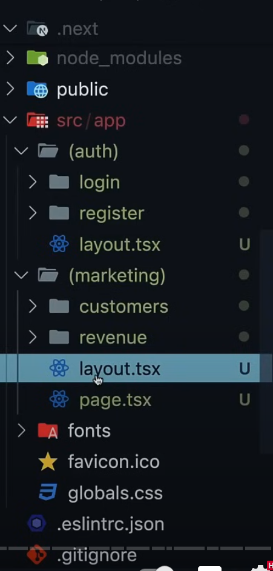

we can have multiple root layouts by removing the root layout in app folder, and add a layout 1 for a route group and another layout 2 for the other group.

for exmaple, if I have register and login page but I dont want to have a header and footer for them, 

1. then we can first remove the root layout in app folder, and we can have (auth) route group , add a layout into this (auth) folder, which will make this route group not to have root layout anymore. 

2. we need to have another route group say (non-auth) for the rest pages in this case and add a layout file that has the header and footer in this folder because the rest route group still needs the header and footer.

3. then we will get an error saying we dont have a layout.tsx in app folder level, then we need to move the root page.tsx into the non-auth route group.  now the page.tsx in (non-auth) still coressponds to localhost://3000 becuase route groups dont affect the routing. 

check the image for more details about the sturcture
